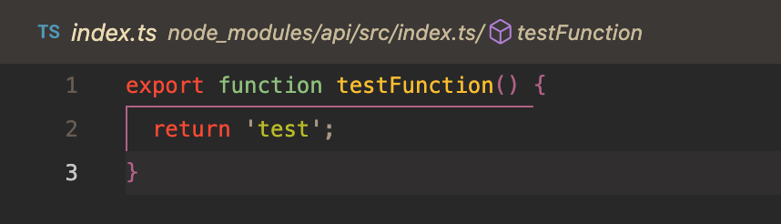

VSCode Symlink Issue
---

This repository allows you to reproduce a symlink bug that occurs in the current version of VSCode.

```
Version: 1.74.2 (Universal)
Commit: e8a3071ea4344d9d48ef8a4df2c097372b0c5161
Date: 2022-12-20T10:26:09.430Z
Electron: 19.1.8
Chromium: 102.0.5005.167
Node.js: 16.14.2
V8: 10.2.154.15-electron.0
OS: Darwin x64 22.2.0
Sandboxed: No
```

# Steps to reproduce
1. Run `yarn` to set up all dependencies (i.e. `typescript`).
2. Run `yarn build` inside `packages/api` and also in `packages/app`.
3. Open VSCode and navigate to [`packages/app/src/index.ts`](packages/app/src/index.ts).
4. Place cursor inside the function call to `testFunction()` and hit go to definition.

### Expected Result
VSCode opens the file [`packages/api/src/index.ts`](packages/api/src/index.ts) in the editor and also focuses it in the Explorer window.

### Actual Result
VSCode opens the file path `node_modules/api/src/index.ts` which is actually symlinked to the expected file but VSCode does not resolve the symlink.

Screenshot:
